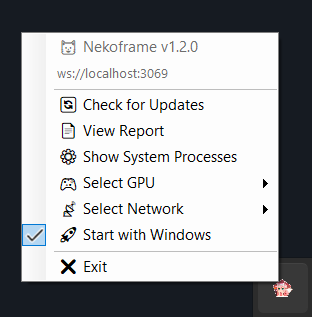

# Nekoframe

  
  

    <a href="https://youtu.be/lnRToLpockw">▶️ <b>Watch Video Showcase</b></a> &nbsp;|&nbsp; 
    <a href="https://steamcommunity.com/sharedfiles/filedetails/?id=3791578910">🎮 <b>Wallux on Steam Workshop</b></a>
  

**Nekoframe** is a lightweight, background Windows service that collects real-time hardware telemetry (CPU, GPU, RAM, Disks, Network, and Fans) and broadcasts it locally over a WebSocket connection.

It's designed to act as a silent, ultra-efficient data provider for external dashboards, hardware monitoring displays, stream overlays, or local web apps [Wallux Wallpaper Engine HUD](https://steamcommunity.com/sharedfiles/filedetails/?id=3791578910).

---

## Features

- **Zero UI Overhead:** Runs entirely in the Windows System Tray.
- **Deep Sensor Support:** Powered by [LibreHardwareMonitor](https://github.com/LibreHardwareMonitor/LibreHardwareMonitor), it reads core temps, junction/hotspot temps, power draw, VRAM usage, and fan RPMs..
- **Admin-Ready:** Installs with a Scheduled Task that automatically starts the app with Highest Privileges on user logon, bypassing UAC prompts.

---

## WebSocket API

Once running, Nekoframe broadcasts a complete system snapshot every **1000ms** to any connected WebSocket client.

- **Default Address:** `ws://localhost:3069`
- **Data Format:** JSON

---

## Configuration

You can easily change the default WebSocket port.

1. Navigate to the Nekoframe app directory (usually `C:\Program Files\Nekoframe`).
2. Open `config.json`.
3. Change the `"WebSocketPort"` value from `3069` to your desired port.
4. Restart Nekoframe from the system tray.

---

## License

This project is for personal use and is distributed "as-is".use at your own risk.
