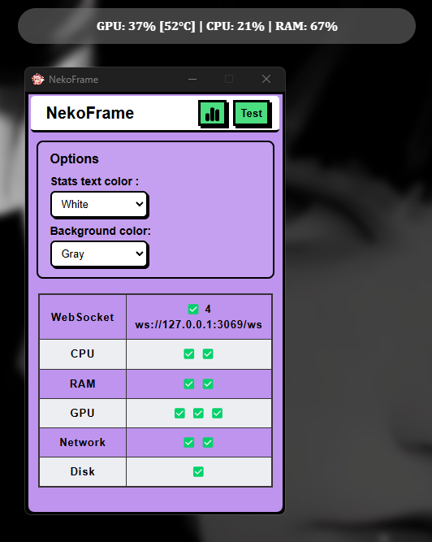

# NekoFrame

A lightweight system monitoring application that fetches real-time system statistics using WebSocket connections. Built with Tauri and JavaScript.

This application is designed to create interactive web wallpapers for Wallpaper Engine, providing real-time system statistics for a sci-fi experience that goes beyond simple animations.

## NekoFrame Application

## Features

- Real-time system monitoring via WebSocket
- Background service with minimal resource usage
- System metrics monitoring:
  - System health status and warnings
  - CPU usage and specifications
  - RAM usage and capacity
  - GPU status (NVIDIA only)
  - Network traffic (upload/download)
  - Disk information
  - Process monitoring and count
  - Top processes by resource usage

## Installation

1. Download the latest release from the [Releases](https://github.com/nubsuki/Nekoframe/releases) page
2. Run the installer
3. The application will start automatically and run in the background

## Testing

1. Launch the application
2. Click the "Test" button to verify all functionalities are working correctly
3. Check the connection status and available metrics

## Integration
You can check out my project: 
[Wallux](https://github.com/nubsuki/Wallux_wallpaper-engine)

### Limitations

- GPU monitoring currently supports NVIDIA GPUs only
- WebSocket connection is limited to localhost 

## License
This project is for personal use and is distributed "as-is".use at your own risk.